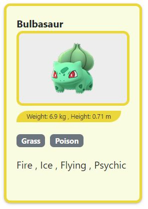
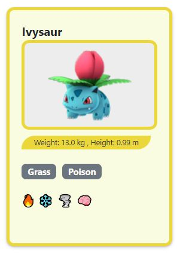

  # POKEDEX 🎴
  Partendo da un array di pokemon - ognuno con le proprie caratteristiche (oggetti) dovrete:

  #### MILESTONE 1  
  Mostrare le card all'interno della pagina creandole dinamicamente (da js), inizialmente mostriamo nome e immagine

  

  #### MILESTONE 2  
  Aggiungere alle singole caratteristiche di ciascun pokemon i tipi - sotto forma di badge - e le debolezze sotto forma di lista con virgole es. (Grass, Poison)
  
  
  
  #### MILESTONE 3
  Trasformare la lista delle debolezze da elenco separato da virgole a singole icone tramite lista "wicons"

  #### MILESTONE 4  
  Aggiungere un indicazione della lunghezza dei pokemon visibili prima della lista

  #### MILESTONE 5 
  Aggiungere la logica per i bottoni di ricerca e reset. Scrivendo nell'input e premendo il bottone cerca dovrà essere aggiornata la lista dei pokemon visibili con solo quelli che contengono l'input inserito dall'utente.  
  L'indicazione dei pokemon visibili della milestone 4 dovrà aggiornarsi a ogni ricerca e ripristinarsi al reset

  #### MILESTONE 6 
  Al click su ciascuna card dovrà venir mostrato un badge sulla stessa che permette di aggiungere il pokemon ai preferiti  
  Cliccando nuovamente sulla card il badge dev'essere rimosso  
  <ins>NOTA:</ins> il badge dovrà rimanere visibile anche quando si filtra la lista
  
  #### MILESTONE 7  
  Creare una lista dei preferiti e renderla visibile come elenco sopra il numero dei pokemon visibili.  
  La lista verrà popolata al click su ciascuna card e dovrà venir mostrato un badge sulla stessa  
  Cliccando nuovamente sulla card il badge dev'essere rimosso e la lista aggiornata  
  <ins>NOTA:</ins> il badge dovrà rimanere visibile anche quando si filtra la lista
  
  #### MILESTONE 8
  
  Creare due campi di testo (tra numero pokemon visibili e lista preferiti) con:
  - il numero dei pokemon - visibili - di tipo Elettro
  - il numero dei pokemon - visibili - di tipo Psico

  <ins> NOTA:</ins> i contatori devono essere aggiornati ogni volta che viene aggiornata la lista dei pokemon visibili

  
  